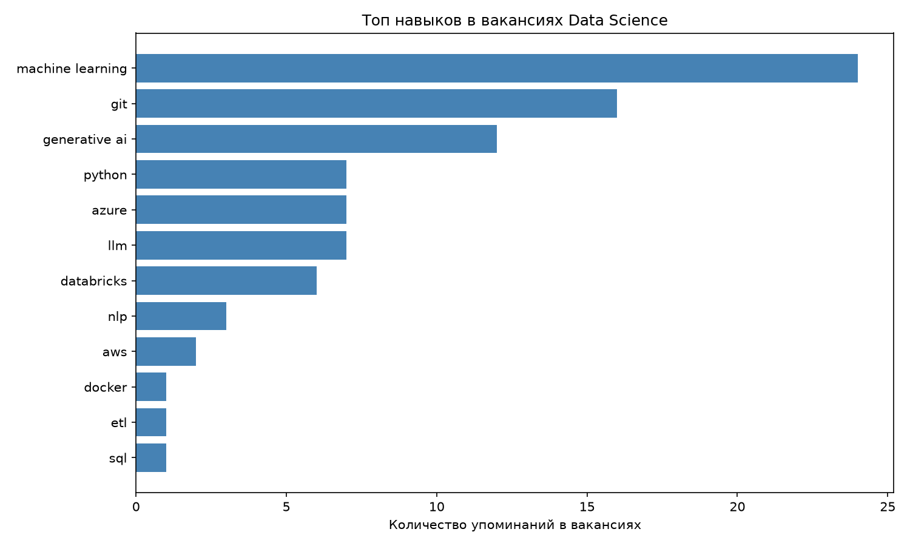

# 📊 Data Science Job Market Analysis

Анализ рынка вакансий Data Scientist: какие навыки и технологии 
реально требуют работодатели, на основе данных, собранных через Adzuna API.

## 🎯 Цель проекта

Как выпускница бакалавриата, поступающая на магистратуру по Data Science, 
я хотела понять реальные требования рынка труда — не из теоретических курсов, 
а из свежих вакансий. Проект — это end-to-end пайплайн: сбор данных через API 
→ очистка → анализ → визуализация.

## 🛠 Технологии

- Python (pandas, requests, matplotlib)
- Adzuna API (сбор вакансий)
- Jupyter Notebook

## 📈 Результаты



**Ключевые находки:**
- Собрано 237 вакансий по запросу "data scientist", из них 46 относятся 
  напрямую к роли Data Scientist
- Анализ навыков проведён на всём датасете (237 вакансий), чтобы получить 
  более широкую статистику по рынку
- Самые частые технологии: Machine Learning, Git, Generative AI/LLM
- GenAI и LLM встречаются почти так же часто, как классический ML — 
  рынок явно смещается в сторону генеративного ИИ
- Python, Azure, Databricks — основной технический стек

## ⚠️ Ограничения данных

Adzuna API возвращает **обрезанное описание вакансии** (~300 символов), 
а не полный текст. Из-за этого не все технические требования 
попали в анализ. Эти результаты лучше рассматривать как приблизительный ориентир, а не как конечную истину.

## 🚀 Как запустить

```bash
git clone <ссылка на репозиторий>
cd ds-jobs-analysis
python -m venv venv
venv\Scripts\activate  # для Windows
pip install -r requirements.txt
```

Необходим файл `.env` с ключами Adzuna API:

```
ADZUNA_APP_ID=ваш_id
ADZUNA_APP_KEY=ваш_key
```

Затем откройте `notebooks/exploration.ipynb` и запустите ячейки по порядку.

## 📂 Структура проекта

```
├── data/               # сырые и очищенные данные
├── notebooks/           # Jupyter notebook с анализом
├── results/             # графики и визуализации
├── requirements.txt
└── README.md
```

## 🔮 Возможные улучшения

- Получить полный текст вакансий через парсинг страниц
- Сравнить требования по разным ролям (Data Analyst, ML Engineer, Data Engineer)
- Добавить анализ зарплат по навыкам